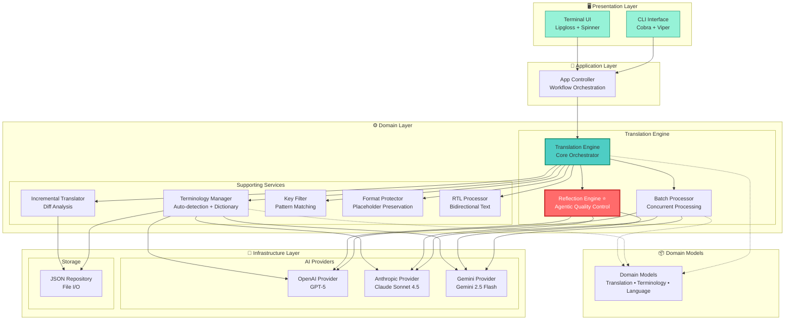
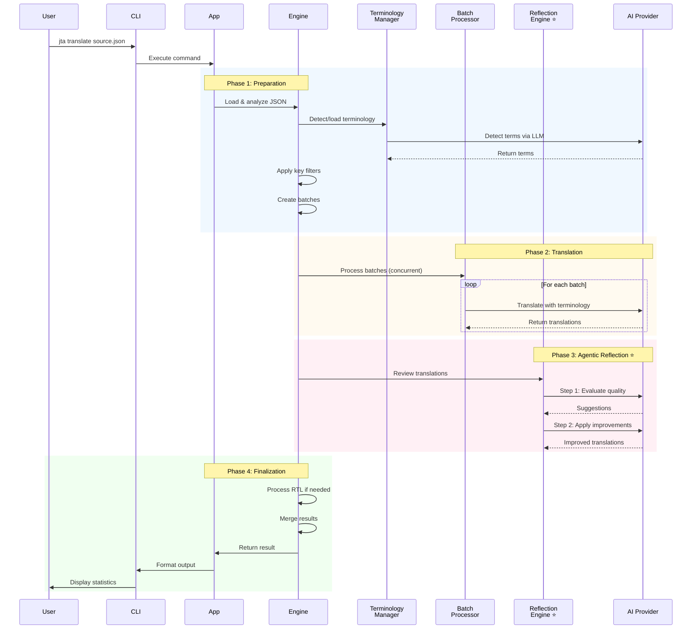

# Jta - JSON Translation Agent

[English](README.md) | [简体中文](README.zh-CN.md)

[](https://go.dev/)
[](LICENSE)
[](coverage.out)
[](https://goreportcard.com/)
[](https://github.com/hikanner/jta/releases)
[](https://github.com/hikanner/homebrew-jta)

> AI-powered Agentic JSON Translation tool with intelligent quality optimization

Jta is a production-ready command-line tool that uses AI to translate JSON internationalization files with **exceptional accuracy and consistency**. Following Andrew Ng's Translation Agent methodology, it features **true Agentic reflection** (translate → reflect → improve), automatic terminology detection, and robust format preservation for production-grade translations.

## 📑 Table of Contents

- [Key Features](#-key-features)
- [Installation](#-installation)
- [Quick Start](#-quick-start)
- [Documentation](#-documentation)
  - [Terminology Management](#terminology-management)
  - [Incremental Translation](#incremental-translation)
  - [Format Protection](#format-protection)
- [Supported AI Providers](#-supported-ai-providers)
- [Supported Languages](#-supported-languages)
- [Architecture](#️-architecture)
- [Examples](#-examples)
- [Configuration](#-configuration)
- [Troubleshooting](#-troubleshooting)
- [FAQ](#-faq)
- [Contributing](#-contributing)
- [License](#-license)
- [Acknowledgments](#-acknowledgments)
- [Support](#-support)
- [Roadmap](#️-roadmap)

## ✨ Key Features

### 🤖 Agentic Translation with Self-Optimization

- **True Agentic Reflection**: Following Andrew Ng's Translation Agent approach with two-step reflection mechanism
- **LLM-Powered Quality Evaluation**: AI evaluates translations across 4 dimensions: accuracy, fluency, style, terminology
- **Expert Suggestions**: LLM generates constructive criticism and improvement suggestions
- **Iterative Improvement**: AI refines translations based on its own expert feedback
- **Cost**: 3x API calls per batch (translate → reflect → improve) for maximum quality

### 📚 Intelligent Terminology Management

- **Automatic Detection**: Uses LLM to identify important terms in your content
- **Preserve Terms**: Brand names, technical terms that should never be translated
- **Consistent Terms**: Domain-specific terms translated uniformly across all content
- **Editable Dictionary**: Saved to `.jta-terminology.json` for manual refinement

### 🔒 Robust Format Protection

Automatically preserves:
- **Placeholders**: `{variable}`, `{{count}}`, `%s`, `%(name)d`
- **HTML Tags**: `<b>`, `<span class="highlight">`, `<a href="...">`
- **URLs**: `https://example.com`, `http://api.example.com/v1`
- **Markdown**: `**bold**`, `*italic*`, `[link](url)`

### ⚡ Smart Incremental Translation

- Only translates new or modified content
- Preserves existing high-quality translations
- Automatically removes obsolete keys
- Saves time and API costs (typically 80-90% reduction on updates)

### 🎯 Flexible Key Filtering

- **Glob Patterns**: `settings.*`, `user.**`, `*.title`
- **Precise Control**: Include or exclude specific sections
- **Recursive Wildcards**: Translate entire subsections with `**`

### 🌍 RTL Language Support

- Proper bidirectional text handling for Arabic, Hebrew, Persian, Urdu
- Automatic direction markers for LTR content in RTL context
- Smart punctuation conversion for Arabic-script languages

### 🚀 Production-Ready Performance

- Batch processing with configurable concurrency
- Retry logic with exponential backoff
- Graceful error handling and recovery
- Progress indicators and detailed statistics

### 🎨 Multi-Provider Support

- **OpenAI**: All models including GPT-5, GPT-5 mini, GPT-5 nano, GPT-4o, etc.
- **Anthropic**: All Claude models including Claude Sonnet 4.5, Claude Haiku 4.5, Claude Opus 4.1, etc.
- **Gemini**: All Gemini models including Gemini 2.5 Flash, Gemini 2.5 Pro, etc.

## 📦 Installation

### Homebrew (macOS/Linux) - Recommended

The easiest way to install Jta on macOS or Linux:

```bash
# Add the tap
brew tap hikanner/jta

# Install Jta
brew install jta

# Verify installation
jta --version
```

**Upgrade:**
```bash
brew upgrade jta
```

**Uninstall:**
```bash
brew uninstall jta
brew untap hikanner/jta
```

### Download Binary

Download the latest release for your platform from [GitHub Releases](https://github.com/hikanner/jta/releases/latest):

- **macOS**: `jta-darwin-amd64` or `jta-darwin-arm64` (Apple Silicon)
- **Linux**: `jta-linux-amd64` or `jta-linux-arm64`
- **Windows**: `jta-windows-amd64.exe`

```bash
# macOS/Linux example
curl -L https://github.com/hikanner/jta/releases/latest/download/jta-darwin-arm64 -o jta
chmod +x jta
sudo mv jta /usr/local/bin/
```

### Using Go Install

```bash
go install github.com/hikanner/jta/cmd/jta@latest
```

### From Source

```bash
git clone https://github.com/hikanner/jta.git
cd jta
go build -o jta cmd/jta/main.go
```

## 🚀 Quick Start

### Installation

```bash
# Install via Homebrew (recommended for macOS/Linux)
brew tap hikanner/jta
brew install jta

# Or download binary from GitHub Releases
# See Installation section for details
```

### View Supported Languages

```bash
# List all supported languages
jta --list-languages
```

### Basic Usage

```bash
# Translate to a single language
jta en.json --to zh

# Translate to multiple languages
jta en.json --to zh,ja,ko

# Specify output directory
jta en.json --to zh --output ./locales/
```

### With AI Provider Configuration

```bash
# Using environment variables (recommended)
export OPENAI_API_KEY=sk-...
jta en.json --to zh

# Or specify directly
jta en.json --to zh --provider anthropic --api-key sk-ant-...
```

### Advanced Usage

```bash
# Incremental translation (only translate new/modified content)
jta en.json --to zh --incremental

# Skip terminology detection (use existing)
jta en.json --to zh --skip-terminology

# Disable terminology management completely
jta en.json --to zh --no-terminology

# Re-detect terminology (when source language changes)
jta zh.json --to en --redetect-terms

# Translate specific keys only
jta en.json --to zh --keys "settings.*,user.*"

# Exclude certain keys
jta en.json --to zh --exclude-keys "admin.*,internal.*"

# Non-interactive mode (for CI/CD)
jta en.json --to zh,ja,ko -y

# CI/CD with incremental translation
jta en.json --to zh --incremental -y
```

## 📖 Documentation

### Terminology Management

Jta automatically detects important terminology in your source file and ensures consistent translation:

- **Preserve Terms**: Brand names, technical terms that should never be translated (e.g., API, OAuth, GitHub)
- **Consistent Terms**: Domain terms that must be translated uniformly (e.g., credits, workspace, premium)

**File Structure:**

Terminology is stored in a dedicated directory (default `.jta/`):

```
.jta/
├── terminology.json       # Term definitions (source language)
├── terminology.zh.json    # Chinese translations
├── terminology.ja.json    # Japanese translations
└── terminology.ko.json    # Korean translations
```

**terminology.json** (source language terms):
```json
{
  "version": "1.0",
  "sourceLanguage": "en",
  "detectedAt": "2025-01-26T10:30:00Z",
  "preserveTerms": ["API", "OAuth", "JSON"],
  "consistentTerms": ["credits", "workspace", "prompt"]
}
```

**terminology.zh.json** (translations):
```json
{
  "version": "1.0",
  "sourceLanguage": "en",
  "targetLanguage": "zh",
  "translatedAt": "2025-01-26T10:31:00Z",
  "translations": {
    "credits": "积分",
    "workspace": "工作空间",
    "prompt": "提示词"
  }
}
```

**Workflow:**
1. First run: Detects terms → saves to `terminology.json` → translates to target language
2. Subsequent runs: Loads existing terms → translates missing terms only
3. New language: Uses existing `terminology.json` → creates `terminology.{lang}.json`

**Custom Terminology Directory:**
```bash
# Use a shared terminology directory
jta en.json --to zh --terminology-dir ../shared-terms/

# Multiple projects can share the same terminology
jta projectA/en.json --to zh --terminology-dir ~/company-terms/
jta projectB/en.json --to ja --terminology-dir ~/company-terms/
```

### Incremental Translation

**Default behavior: Full translation**
- Jta translates all content by default for maximum quality and consistency
- Simple and predictable: `jta en.json --to zh` always produces a complete translation

**Incremental mode (optional):**
When you use `--incremental` flag, Jta intelligently:

1. Detects new keys
2. Identifies modified content
3. Preserves unchanged translations
4. Removes deleted keys

This saves time and API costs (typically 80-90% reduction on updates).

**Usage:**
```bash
# First time: Full translation
jta en.json --to zh

# After updates: Incremental translation (saves cost)
jta en.json --to zh --incremental

# Re-translate everything (if not satisfied with existing translation)
jta en.json --to zh
```

**Best practice:**
- Development: Use `--incremental` for frequent updates
- Production release: Use full translation for maximum quality
- CI/CD: Use `--incremental -y` for automated updates

### Format Protection

Jta automatically protects:

- Variables: `{variable}`, `{{count}}`, `%s`
- HTML tags: `<b>`, `<span class="highlight">`
- URLs: `https://example.com`
- Markdown: `**bold**`, `*italic*`

## 🎯 Supported AI Providers

| Provider | Models | Environment Variable |
|----------|--------|---------------------|
| OpenAI | All OpenAI models (GPT-5, GPT-5 mini, GPT-5 nano, GPT-4o, etc.) | `OPENAI_API_KEY` |
| Anthropic | All Claude models (Claude Sonnet 4.5, Claude Haiku 4.5, Claude Opus 4.1, etc.) | `ANTHROPIC_API_KEY` |
| Gemini | All Gemini models (Gemini 2.5 Flash, Gemini 2.5 Pro, etc.) | `GEMINI_API_KEY` |

You can specify any model supported by these providers using the `--model` flag.

## 🌍 Supported Languages

Jta supports **27 languages** with full metadata including flags, scripts, and number systems:

### List All Supported Languages

```bash
# View all supported languages
jta --list-languages
```

**Output:**
```
🌍 Supported Languages

Left-to-Right (LTR):
  🇬🇧  en      English (English)
  🇨🇳  zh      中文(简体) (Chinese (Simplified))
  🇹🇼  zh-TW   中文(繁体) (Chinese (Traditional))
  🇯🇵  ja      日本語 (Japanese)
  🇰🇷  ko      한국어 (Korean)
  🇪🇸  es      Español (Spanish)
  🇫🇷  fr      Français (French)
  🇩🇪  de      Deutsch (German)
  🇮🇹  it      Italiano (Italian)
  🇵🇹  pt      Português (Portuguese)
  🇷🇺  ru      Русский (Russian)
  🇮🇳  hi      हिन्दी (Hindi)
  🇧🇩  bn      বাংলা (Bengali)
  🇹🇭  th      ไทย (Thai)
  🇻🇳  vi      Tiếng Việt (Vietnamese)
  🇮🇩  id      Bahasa Indonesia (Indonesian)
  🇲🇾  ms      Bahasa Melayu (Malay)
  🇳🇱  nl      Nederlands (Dutch)
  🇵🇱  pl      Polski (Polish)
  🇹🇷  tr      Türkçe (Turkish)
  🇱🇰  si      සිංහල (Sinhala)
  🇳🇵  ne      नेपाली (Nepali)
  🇲🇲  my      မြန်မာ (Burmese)

Right-to-Left (RTL):
  🇸🇦  ar      العربية (Arabic)
  🇮🇷  fa      فارسی (Persian)
  🇮🇱  he      עברית (Hebrew)
  🇵🇰  ur      اردو (Urdu)

Total: 27 languages
```

### RTL Language Support

Special support for Right-to-Left languages (Arabic, Persian, Hebrew, Urdu):
- Automatic bidirectional text markers
- Smart punctuation conversion for Arabic-script languages
- Proper handling of embedded LTR content (URLs, numbers, code)

### Language Examples

```bash
# Translate to Chinese (Simplified)
jta en.json --to zh

# Translate to Chinese (Traditional)
jta en.json --to zh-TW

# Translate to multiple Asian languages
jta en.json --to zh,ja,ko,th,vi

# Translate to RTL languages
jta en.json --to ar,fa,he

# Translate to European languages
jta en.json --to es,fr,de,it,pt,nl
```

## 🏗️ Architecture

Jta follows a clean, modular architecture with clear separation of concerns:

### System Architecture



### Module Responsibilities

| Module | Responsibility | Key Features |
|--------|---------------|--------------|
| **CLI** | Command-line interface | Argument parsing, help text, command execution |
| **UI** | Terminal presentation | Colored output, spinners, progress bars, tables |
| **App** | Application orchestration | Workflow coordination, error handling, result formatting |
| **Translation Engine** | Core translation logic | Batch management, workflow control, result assembly |
| **Batch Processor** | Concurrent processing | Parallel API calls, retry logic, rate limiting |
| **Reflection Engine** ⭐ | Agentic quality control | LLM self-evaluation, improvement suggestions |
| **Terminology Manager** | Term management | Auto-detection, dictionary building, term translation |
| **Incremental Translator** | Delta processing | Diff analysis, selective translation, merge logic |
| **Key Filter** | Selective translation | Pattern matching, inclusion/exclusion rules |
| **Format Protector** | Format preservation | Placeholder detection, HTML/URL/Markdown protection |
| **RTL Processor** | RTL language support | Bidirectional markers, punctuation conversion |
| **AI Providers** | LLM integration | API abstraction, response parsing, error handling |
| **JSON Repository** | Data persistence | File I/O, JSON marshaling, validation |

### Translation Workflow



**Key Steps:**

1. **Load & Analyze**: Load source JSON, detect changes (incremental mode)
2. **Terminology**: Auto-detect or load terminology dictionary
3. **Filter**: Apply key filters if specified
4. **Batch**: Split into batches for efficient processing
5. **Translate**: Send to AI provider with format instructions
6. **Reflect** ⭐: Two-step Agentic quality improvement (see below)
7. **Process RTL**: Apply bidirectional text handling if needed
8. **Merge**: Combine with unchanged translations
9. **Save**: Write final output with pretty formatting

### 🔄 Agentic Reflection Mechanism

Jta implements Andrew Ng's Translation Agent approach with a **true two-step reflection process**:

#### Step 1: Initial Translation (1x API)
```
Source: "Welcome to {app_name}"
→ LLM Translation
→ Result: "欢迎使用 {app_name}"
```

#### Step 2: Reflection - LLM Evaluates Quality (1x API)
```
Prompt to LLM:
"Evaluate this translation across 4 dimensions:
(i) accuracy - errors, mistranslations, omissions
(ii) fluency - grammar, punctuation, repetitions
(iii) style - cultural context, tone matching
(iv) terminology - consistency, domain terms

Provide constructive suggestions for improvement."

→ LLM Response:
"[welcome.message] Consider using '欢迎来到' instead of '欢迎使用' 
for a warmer, more inviting tone that better matches 'Welcome to'"
```

#### Step 3: Improvement - LLM Applies Suggestions (1x API)
```
Prompt to LLM:
"Original: Welcome to {app_name}
Initial: 欢迎使用 {app_name}
Suggestion: Use '欢迎来到' for warmer tone

Edit the translation ensuring accuracy, fluency, style, terminology."

→ LLM Response:
"[welcome.message] 欢迎来到 {app_name}"
```

#### Why This Approach?

**Advantages:**
- ✅ **LLM Self-Evaluation**: AI discovers subtle quality issues humans/rules might miss
- ✅ **Deep Analysis**: Evaluates accuracy, fluency, style, cultural context
- ✅ **Explicit Reasoning**: Generates specific, actionable improvement suggestions
- ✅ **Higher Quality**: Iterative refinement produces more natural, accurate translations

**Cost:**
- 3x API calls per batch (translate → reflect → improve)
- For 100 keys with batch-size 20: 15 total API calls (5 translate + 5 reflect + 5 improve)
- Trade-off: 3x cost for significantly higher translation quality

**Configurable:**
- Batch size: `--batch-size 10` (smaller = safer, larger = efficient)
- Model selection: Stronger models (GPT-5, Claude Sonnet 4.5) handle larger batches better

## 💡 Examples

### Example 1: First-time Translation

```bash
$ jta en.json --to zh

📄 Loading source file...
✓ Source file loaded

📚 Loading terminology...
🔍 Detecting terminology...
✓ Detected 8 terms

🤖 Translating...
✓ Translation completed

💾 Saving translation...
✓ Saved to zh.json

📊 Translation Statistics
   Total items     100
   Success         100
   Failed          0
   Duration        45s
   API calls       15 (5 translate + 5 reflect + 5 improve)
```

**Generated `.jta-terminology.json`:**
```json
{
  "source_language": "en",
  "preserve_terms": ["GitHub", "API", "OAuth"],
  "consistent_terms": {
    "en": ["repository", "commit", "pull request"]
  }
}
```

### Example 2: Incremental Update

```bash
$ jta en.json --to zh

📄 Loading source file...
✓ Source file loaded

🔍 Analyzing changes...
   New: 5 keys
   Modified: 2 keys
   Unchanged: 93 keys

Continue? [Y/n] y

🤖 Translating...
✓ Translation completed

📊 Translation Statistics
   Total items     7
   Success         7
   Filtered        93 included, 0 excluded (of 100 total)
   Duration        3s
   API calls       1
```

### Example 3: Key Filtering

```bash
# Translate only settings and user sections
$ jta en.json --to ja --keys "settings.**,user.**"

📊 Translation Statistics
   Filtered        45 included, 55 excluded (of 100 total)
   Total items     45
   Success         45
```

### Example 4: Multi-language Batch

```bash
# Translate to multiple languages at once
$ jta en.json --to zh,ja,ko,es,fr -y

Processing: zh ━━━━━━━━━━━━━━━━━━━━ 100% (100/100) ✓
Processing: ja ━━━━━━━━━━━━━━━━━━━━ 100% (100/100) ✓
Processing: ko ━━━━━━━━━━━━━━━━━━━━ 100% (100/100) ✓
Processing: es ━━━━━━━━━━━━━━━━━━━━ 100% (100/100) ✓
Processing: fr ━━━━━━━━━━━━━━━━━━━━ 100% (100/100) ✓

✓ Successfully created 5 translation files
```

### Example 5: CI/CD Integration

```yaml
# .github/workflows/translate.yml
name: Auto-translate i18n files

on:
  push:
    paths:
      - 'locales/en.json'

jobs:
  translate:
    runs-on: ubuntu-latest
    steps:
      - uses: actions/checkout@v3
      
      - name: Install Jta
        run: |
          # Option 1: Using Homebrew (Linux)
          brew tap hikanner/jta
          brew install jta
          
          # Option 2: Using Go
          # go install github.com/hikanner/jta/cmd/jta@latest
          
          # Option 3: Download binary
          # curl -L https://github.com/hikanner/jta/releases/latest/download/jta-linux-amd64 -o jta
          # chmod +x jta
          # sudo mv jta /usr/local/bin/
      
      - name: Translate
        env:
          OPENAI_API_KEY: ${{ secrets.OPENAI_API_KEY }}
        run: |
          jta locales/en.json --to zh,ja,ko -y
      
      - name: Commit translations
        run: |
          git config user.name "Translation Bot"
          git config user.email "bot@example.com"
          git add locales/*.json
          git commit -m "chore: update translations" || exit 0
          git push
```

## 🛠 Configuration

### Environment Variables

```bash
# AI Provider API Keys
export OPENAI_API_KEY=sk-...
export ANTHROPIC_API_KEY=sk-ant-...
export GEMINI_API_KEY=...
```

### Command-line Options

```
Flags:
  --to string                  Target language(s), comma-separated (required for translation)
  --list-languages             List all supported languages and exit
  --provider string            AI provider (openai, anthropic, gemini) (default "openai")
  --model string               Model name (uses default if not specified)
  --api-key string             API key (or use environment variable)
  --source-lang string         Source language (auto-detected from filename if not specified)
  -o, --output string          Output file or directory
  --terminology-dir string     Terminology directory (default ".jta/")
  --skip-terminology           Skip term detection (use existing terminology)
  --no-terminology             Disable terminology management completely
  --redetect-terms             Re-detect terminology (use when source language changes)
  --incremental                Incremental translation (only translate new/modified content)
  --keys string                Only translate specified keys (glob patterns)
  --exclude-keys string        Exclude specified keys (glob patterns)
  --batch-size int             Batch size for translation (default 20)
  --concurrency int            Concurrency for batch processing (default 3)
  -y, --yes                    Non-interactive mode
  -v, --verbose                Verbose output
```

## 🔧 Troubleshooting

### Common Issues

#### API Key Not Found

```bash
Error: OPENAI_API_KEY environment variable not set
```

**Solution**: Set the API key as an environment variable or pass it directly:
```bash
export OPENAI_API_KEY=sk-...
# Or
jta en.json --to zh --api-key sk-...
```

#### Translation Quality Issues

If translations are not meeting quality expectations:

1. **Use a better model**: Generally, newer/larger models provide better quality
   ```bash
   # OpenAI
   jta en.json --to zh --provider openai --model gpt-5
   
   # Anthropic
   jta en.json --to zh --provider anthropic --model claude-sonnet-4-5
   
   # Gemini
   jta en.json --to zh --provider gemini --model gemini-2.5-flash
   ```

2. **Check terminology**: Review and refine terminology files in `.jta/`
   ```bash
   # Edit term definitions
   vim .jta/terminology.json
   
   # Edit translations
   vim .jta/terminology.zh.json
   ```
   
   Example `terminology.json`:
   ```json
   {
     "version": "1.0",
     "sourceLanguage": "en",
     "preserveTerms": ["YourBrand", "ProductName", "API"],
     "consistentTerms": ["important", "domain", "terms"]
   }
   ```

3. **Verify Agentic reflection is working**: The two-step reflection (evaluate → improve) runs automatically. In verbose mode, you should see:
   ```bash
   jta en.json --to zh --verbose
   
   # Look for reflection output showing:
   # - Step 2: Reflection (LLM evaluating quality)
   # - Step 3: Improvement (LLM applying suggestions)
   # - API calls: 3x per batch (translate + reflect + improve)
   ```

#### Format Elements Lost in Translation

The format protector should automatically preserve placeholders, but if you notice issues:

1. Check the format instructions in verbose mode
2. Verify your placeholders follow standard patterns: `{var}`, `{{var}}`, `%s`, `%d`
3. Report non-standard formats as issues

#### Rate Limit Errors

```bash
Error: Rate limit exceeded
```

**Solution**: Reduce concurrency and batch size:
```bash
jta en.json --to zh --concurrency 1 --batch-size 10
```

#### Large File Handling

For files with 1000+ keys:

```bash
# Process in smaller batches with lower concurrency
jta large.json --to zh --batch-size 10 --concurrency 2

# Or filter by sections
jta large.json --to zh --keys "section1.**"
jta large.json --to zh --keys "section2.**"
```

### Performance Tips

1. **Batch Size**: Larger batches (20-50) are more efficient but use more tokens per request
2. **Concurrency**: Higher concurrency (3-5) speeds up translation but may hit rate limits
3. **Incremental Mode**: Always use incremental translation for updates (automatic)
4. **Provider Selection**: Choose based on your needs:
   - **Quality priority**: Use latest/largest models from any provider
   - **Speed priority**: Use faster models like GPT-3.5 Turbo or Gemini Flash
   - **Cost priority**: Compare pricing across providers and choose smaller models
   - **Balance**: GPT-4o, Claude 3.5 Sonnet, or Gemini 1.5 Pro offer good balance

### Debug Mode

Enable verbose output to see detailed execution:

```bash
jta en.json --to zh --verbose

# You'll see:
# - Provider initialization
# - Batch processing details
# - Reflection engine decisions
# - API call statistics
# - Format validation reports
```

## ❓ FAQ

**Q: How much does it cost to translate a typical i18n file?**

A: For a 100-key file using OpenAI GPT-4o with Agentic reflection (3x API calls):
- First translation: ~$0.15-0.30 (including reflection)
- Incremental updates: ~$0.03-0.06 (only new/modified keys)
- Without reflection (basic translate only): ~$0.05-0.10
- Trade-off: 3x cost for significantly higher quality through AI self-evaluation and improvement

**Q: Can I translate offline or use my own models?**

A: Currently, Jta requires an internet connection and uses cloud AI providers. Local model support is planned for a future release.

**Q: Does Jta support variables inside translated strings?**

A: Yes! All standard placeholder formats are automatically preserved:
- `{variable}`, `{{count}}` (i18next, Vue I18n)
- `%s`, `%d`, `%(name)s` (printf-style)
- `<b>`, `<span>` (HTML tags)

**Q: How do I handle custom terminology?**

A: Edit `.jta-terminology.json` manually:
```json
{
  "source_language": "en",
  "preserve_terms": ["MyApp", "SpecialFeature"],
  "consistent_terms": {
    "en": ["user", "account", "settings"]
  }
}
```

Then run translation with `--skip-terms` to use your custom dictionary.

**Q: Can I review translations before saving?**

A: Currently, translations are saved automatically. For manual review:
1. Use `--output` to save to a separate file
2. Review and edit the output
3. Copy to your actual locale file when satisfied

**Q: What languages are supported?**

A: Jta currently supports **27 languages** with full metadata:
- **European**: English, Spanish, French, German, Italian, Portuguese, Russian, Dutch, Polish, Turkish
- **Asian**: Chinese (Simplified/Traditional), Japanese, Korean, Thai, Vietnamese, Indonesian, Malay, Hindi, Bengali, Sinhala, Nepali, Burmese
- **Middle Eastern (RTL)**: Arabic, Persian, Hebrew, Urdu

To see the complete list with flags and native names:
```bash
jta --list-languages
```

Jta also supports any other language that your chosen AI provider supports - just use the standard language code (e.g., `sv` for Swedish, `da` for Danish).

**Q: How is this different from other translation tools?**

A: Jta's true Agentic approach following Andrew Ng's methodology sets it apart:
1. **AI Self-Evaluation**: LLM evaluates its own translations across accuracy, fluency, style, terminology
2. **Iterative Improvement**: Two-step reflection (evaluate → improve) produces higher quality
3. **Context-aware**: Understands domain terminology and cultural nuances
4. **Format-safe**: Never breaks your placeholders or markup
5. **Incremental**: Saves 80-90% on updates by only translating changes
6. **Production-ready**: Built with Go for reliability and performance

## 🤝 Contributing

Contributions are welcome! Please read our [Contributing Guide](CONTRIBUTING.md) for details.

### Development Setup

```bash
# Clone the repository
git clone https://github.com/hikanner/jta.git
cd jta

# Install dependencies
go mod download

# Run tests
go test ./...

# Build
go build -o jta cmd/jta/main.go

# Run locally
./jta examples/en.json --to zh
```

## 📄 License

MIT License - see [LICENSE](LICENSE) for details.

## 🙏 Acknowledgments

- Inspired by [Andrew Ng's Translation Agent](https://github.com/andrewyng/translation-agent)
- Built with official AI provider SDKs:
  - [OpenAI Go SDK](https://github.com/openai/openai-go)
  - [Anthropic Go SDK](https://github.com/anthropics/anthropic-sdk-go)
  - [Google GenAI Go SDK](https://github.com/google/generative-ai-go)
- Powered by:
  - [Cobra](https://github.com/spf13/cobra) for CLI
  - [Lipgloss](https://github.com/charmbracelet/lipgloss) for beautiful terminal output
  - [Sonic](https://github.com/bytedance/sonic) for fast JSON parsing

## 📞 Support

- 🐛 **Bug Reports**: [GitHub Issues](https://github.com/hikanner/jta/issues)
- 💬 **Discussions**: [GitHub Discussions](https://github.com/hikanner/jta/discussions)
- 📖 **Documentation**: [Wiki](https://github.com/hikanner/jta/wiki)
- ⭐ **Star us**: If you find Jta useful, give us a star on GitHub!

## 🗺️ Roadmap

- [ ] Support for local/self-hosted LLMs
- [ ] Interactive translation review mode
- [ ] Translation memory (TMX) integration
- [ ] Custom prompt templates
- [ ] Web UI for terminology management
- [ ] Support for additional file formats (YAML, XML, PO)
- [ ] Translation statistics and analytics
- [ ] A/B testing for translation quality

---

**Made with ❤️ by the Jta team**

*Jta - Making i18n translation intelligent, reliable, and effortless.*
