# Jta - JSON 翻译智能体

[English](README.md) | [简体中文](README.zh-CN.md)

[](https://go.dev/)
[](LICENSE)
[](coverage.out)
[](https://goreportcard.com/)
[](https://github.com/hikanner/jta/releases)
[](https://github.com/hikanner/homebrew-jta)

> AI 驱动的智能体式 JSON 翻译工具，具备智能质量优化功能

Jta 是一个生产级的命令行工具，使用 AI 翻译 JSON 国际化文件，具有**卓越的准确性和一致性**。遵循 Andrew Ng 的翻译智能体方法论，它具备**真正的智能体反思机制**（翻译 → 反思 → 改进）、自动术语检测和强大的格式保护功能，适用于生产级翻译。

## ✨ 核心特性

### 🤖 智能体翻译与自我优化

- **真正的智能体反思**：遵循 Andrew Ng 的翻译智能体方法，采用两步反思机制
- **LLM 驱动的质量评估**：AI 从 4 个维度评估翻译：准确性、流畅性、风格、术语
- **专家建议**：LLM 生成建设性的批评和改进建议
- **迭代改进**：AI 基于自己的专家反馈优化翻译
- **成本**：每批次 3 次 API 调用（翻译 → 反思 → 改进），以获得最高质量

### 📚 智能术语管理

- **自动检测**：使用 LLM 识别内容中的重要术语
- **保留术语**：品牌名称、技术术语等永不翻译
- **一致术语**：领域特定术语在所有内容中统一翻译
- **可编辑词典**：保存到 `.jta-terminology.json`，支持手动优化

### 🔒 强大的格式保护

自动保护：
- **占位符**：`{variable}`、`{{count}}`、`%s`、`%(name)d`
- **HTML 标签**：`<b>`、`<span class="highlight">`、`<a href="...">`
- **URL**：`https://example.com`、`http://api.example.com/v1`
- **Markdown**：`**粗体**`、`*斜体*`、`[链接](url)`

### ⚡ 智能增量翻译

- 仅翻译新增或修改的内容
- 保留现有的高质量翻译
- 自动移除过时的键
- 节省时间和 API 成本（更新时通常可减少 80-90%）

### 🎯 灵活的键过滤

- **通配符模式**：`settings.*`、`user.**`、`*.title`
- **精确控制**：包含或排除特定部分
- **递归通配符**：使用 `**` 翻译整个子部分

### 🌍 RTL 语言支持

- 阿拉伯语、希伯来语、波斯语、乌尔都语的双向文本处理
- RTL 上下文中 LTR 内容的自动方向标记
- 阿拉伯文字语言的智能标点转换

### 🚀 生产级性能

- 可配置并发的批处理
- 指数退避的重试逻辑
- 优雅的错误处理和恢复
- 进度指示器和详细统计

### 🎨 多提供商支持

- **OpenAI**：所有模型，包括 GPT-5、GPT-5 mini、GPT-5 nano、GPT-4o 等
- **Anthropic**：所有 Claude 模型，包括 Claude Sonnet 4.5、Claude Haiku 4.5、Claude Opus 4.1 等
- **Gemini**：所有 Gemini 模型，包括 Gemini 2.5 Flash、Gemini 2.5 Pro 等

## 📦 安装

### Homebrew（macOS/Linux）- 推荐

在 macOS 或 Linux 上安装 Jta 最简单的方法：

```bash
# 添加 tap
brew tap hikanner/jta

# 安装 Jta
brew install jta

# 验证安装
jta --version
```

**升级：**
```bash
brew upgrade jta
```

**卸载：**
```bash
brew uninstall jta
brew untap hikanner/jta
```

### 下载二进制文件

从 [GitHub Releases](https://github.com/hikanner/jta/releases/latest) 下载适合您平台的最新版本：

- **macOS**：`jta-darwin-amd64` 或 `jta-darwin-arm64`（Apple Silicon）
- **Linux**：`jta-linux-amd64` 或 `jta-linux-arm64`
- **Windows**：`jta-windows-amd64.exe`

```bash
# macOS/Linux 示例
curl -L https://github.com/hikanner/jta/releases/latest/download/jta-darwin-arm64 -o jta
chmod +x jta
sudo mv jta /usr/local/bin/
```

### 使用 Go Install

```bash
go install github.com/hikanner/jta/cmd/jta@latest
```

### 从源码构建

```bash
git clone https://github.com/hikanner/jta.git
cd jta
go build -o jta cmd/jta/main.go
```

## 🚀 快速开始

### 安装

```bash
# 通过 Homebrew 安装（macOS/Linux 推荐）
brew tap hikanner/jta
brew install jta

# 或从 GitHub Releases 下载二进制文件
# 详见安装部分
```

### 查看支持的语言

```bash
# 列出所有支持的语言
jta --list-languages
```

### 基本用法

```bash
# 翻译为单一语言
jta en.json --to zh

# 翻译为多种语言
jta en.json --to zh,ja,ko

# 指定输出目录
jta en.json --to zh --output ./locales/
```

### 配置 AI 提供商

```bash
# 使用环境变量（推荐）
export OPENAI_API_KEY=sk-...
jta en.json --to zh

# 或直接指定
jta en.json --to zh --provider anthropic --api-key sk-ant-...
```

### 高级用法

```bash
# 增量翻译（仅翻译新增/修改的内容）
jta en.json --to zh --incremental

# 跳过术语检测（使用现有术语）
jta en.json --to zh --skip-terminology

# 完全禁用术语管理
jta en.json --to zh --no-terminology

# 重新检测术语（源语言更改时）
jta zh.json --to en --redetect-terms

# 仅翻译特定键
jta en.json --to zh --keys "settings.*,user.*"

# 排除某些键
jta en.json --to zh --exclude-keys "admin.*,internal.*"

# 非交互模式（用于 CI/CD）
jta en.json --to zh,ja,ko -y

# CI/CD 中的增量翻译
jta en.json --to zh --incremental -y
```

## 📖 文档

### 术语管理

Jta 自动检测源文件中的重要术语并确保翻译一致：

- **保留术语**：品牌名称、技术术语等永不翻译（例如：API、OAuth、GitHub）
- **一致术语**：必须统一翻译的领域术语（例如：credits、workspace、premium）

**文件结构：**

术语存储在专用目录中（默认为 `.jta/`）：

```
.jta/
├── terminology.json       # 术语定义（源语言）
├── terminology.zh.json    # 中文翻译
├── terminology.ja.json    # 日文翻译
└── terminology.ko.json    # 韩文翻译
```

**terminology.json**（源语言术语）：
```json
{
  "version": "1.0",
  "sourceLanguage": "en",
  "detectedAt": "2025-01-26T10:30:00Z",
  "preserveTerms": ["API", "OAuth", "JSON"],
  "consistentTerms": ["credits", "workspace", "prompt"]
}
```

**terminology.zh.json**（翻译）：
```json
{
  "version": "1.0",
  "sourceLanguage": "en",
  "targetLanguage": "zh",
  "translatedAt": "2025-01-26T10:31:00Z",
  "translations": {
    "credits": "积分",
    "workspace": "工作空间",
    "prompt": "提示词"
  }
}
```

**工作流程：**
1. 首次运行：检测术语 → 保存到 `terminology.json` → 翻译为目标语言
2. 后续运行：加载现有术语 → 仅翻译缺失的术语
3. 新语言：使用现有的 `terminology.json` → 创建 `terminology.{lang}.json`

**自定义术语目录：**
```bash
# 使用共享术语目录
jta en.json --to zh --terminology-dir ../shared-terms/

# 多个项目可以共享相同的术语
jta projectA/en.json --to zh --terminology-dir ~/company-terms/
jta projectB/en.json --to ja --terminology-dir ~/company-terms/
```

### 增量翻译

**默认行为：完整翻译**
- Jta 默认翻译所有内容以获得最高质量和一致性
- 简单且可预测：`jta en.json --to zh` 始终生成完整翻译

**增量模式（可选）：**
使用 `--incremental` 标志时，Jta 智能地：

1. 检测新增键
2. 识别修改的内容
3. 保留未更改的翻译
4. 移除已删除的键

这可以节省时间和 API 成本（更新时通常减少 80-90%）。

**用法：**
```bash
# 首次：完整翻译
jta en.json --to zh

# 更新后：增量翻译（节省成本）
jta en.json --to zh --incremental

# 重新翻译所有内容（如果对现有翻译不满意）
jta en.json --to zh
```

**最佳实践：**
- 开发阶段：使用 `--incremental` 进行频繁更新
- 生产发布：使用完整翻译以获得最高质量
- CI/CD：使用 `--incremental -y` 进行自动化更新

### 格式保护

Jta 自动保护：

- 变量：`{variable}`、`{{count}}`、`%s`
- HTML 标签：`<b>`、`<span class="highlight">`
- URL：`https://example.com`
- Markdown：`**粗体**`、`*斜体*`

## 🎯 支持的 AI 提供商

| 提供商 | 模型 | 环境变量 |
|----------|--------|---------------------|
| OpenAI | 所有 OpenAI 模型（GPT-5、GPT-5 mini、GPT-5 nano、GPT-4o 等） | `OPENAI_API_KEY` |
| Anthropic | 所有 Claude 模型（Claude Sonnet 4.5、Claude Haiku 4.5、Claude Opus 4.1 等） | `ANTHROPIC_API_KEY` |
| Gemini | 所有 Gemini 模型（Gemini 2.5 Flash、Gemini 2.5 Pro 等） | `GEMINI_API_KEY` |

您可以使用 `--model` 标志指定这些提供商支持的任何模型。

## 🌍 支持的语言

Jta 支持 **27 种语言**，包含完整的元数据（国旗、文字系统和数字系统）：

### 列出所有支持的语言

```bash
# 查看所有支持的语言
jta --list-languages
```

**输出：**
```
🌍 Supported Languages

Left-to-Right (LTR):
  🇬🇧  en      English (English)
  🇨🇳  zh      中文(简体) (Chinese (Simplified))
  🇹🇼  zh-TW   中文(繁体) (Chinese (Traditional))
  🇯🇵  ja      日本語 (Japanese)
  🇰🇷  ko      한국어 (Korean)
  🇪🇸  es      Español (Spanish)
  🇫🇷  fr      Français (French)
  🇩🇪  de      Deutsch (German)
  🇮🇹  it      Italiano (Italian)
  🇵🇹  pt      Português (Portuguese)
  🇷🇺  ru      Русский (Russian)
  🇮🇳  hi      हिन्दी (Hindi)
  🇧🇩  bn      বাংলা (Bengali)
  🇹🇭  th      ไทย (Thai)
  🇻🇳  vi      Tiếng Việt (Vietnamese)
  🇮🇩  id      Bahasa Indonesia (Indonesian)
  🇲🇾  ms      Bahasa Melayu (Malay)
  🇳🇱  nl      Nederlands (Dutch)
  🇵🇱  pl      Polski (Polish)
  🇹🇷  tr      Türkçe (Turkish)
  🇱🇰  si      සිංහල (Sinhala)
  🇳🇵  ne      नेपाली (Nepali)
  🇲🇲  my      မြန်မာ (Burmese)

Right-to-Left (RTL):
  🇸🇦  ar      العربية (Arabic)
  🇮🇷  fa      فارسی (Persian)
  🇮🇱  he      עברית (Hebrew)
  🇵🇰  ur      اردو (Urdu)

Total: 27 languages
```

### RTL 语言支持

对从右到左（RTL）语言（阿拉伯语、波斯语、希伯来语、乌尔都语）的特殊支持：
- 自动双向文本标记
- 阿拉伯文字语言的智能标点转换
- 正确处理嵌入的 LTR 内容（URL、数字、代码）

### 语言示例

```bash
# 翻译为简体中文
jta en.json --to zh

# 翻译为繁体中文
jta en.json --to zh-TW

# 翻译为多种亚洲语言
jta en.json --to zh,ja,ko,th,vi

# 翻译为 RTL 语言
jta en.json --to ar,fa,he

# 翻译为欧洲语言
jta en.json --to es,fr,de,it,pt,nl
```

## 🏗️ 架构

Jta 遵循清晰、模块化的架构，具有明确的关注点分离：

### 系统架构

```mermaid
graph TB
    subgraph "🖥️ Presentation Layer"
        CLI[CLI Interface<br/>Cobra + Viper]
        UI[Terminal UI<br/>Lipgloss + Spinner]
    end
    
    subgraph "🔧 Application Layer"
        APP[App Controller<br/>Workflow Orchestration]
    end
    
    subgraph "⚙️ Domain Layer"
        subgraph "Translation Engine"
            ENGINE[Translation Engine<br/>Core Orchestrator]
            BATCH[Batch Processor<br/>Concurrent Processing]
            REFLECT[Reflection Engine ⭐<br/>Agentic Quality Control]
        end
        
        subgraph "Supporting Services"
            TERM[Terminology Manager<br/>Auto-detection + Dictionary]
            INCR[Incremental Translator<br/>Diff Analysis]
            FILTER[Key Filter<br/>Pattern Matching]
            FORMAT[Format Protector<br/>Placeholder Preservation]
            RTL[RTL Processor<br/>Bidirectional Text]
        end
    end
    
    subgraph "🔌 Infrastructure Layer"
        subgraph "AI Providers"
            OPENAI[OpenAI Provider<br/>GPT-5]
            ANTHROPIC[Anthropic Provider<br/>Claude Sonnet 4.5]
            GEMINI[Gemini Provider<br/>Gemini 2.5 Flash]
        end
        
        subgraph "Storage"
            JSON[JSON Repository<br/>File I/O]
        end
    end
    
    subgraph "📦 Domain Models"
        MODELS[Domain Models<br/>Translation • Terminology • Language]
    end
    
    CLI --> APP
    UI --> APP
    APP --> ENGINE
    ENGINE --> BATCH
    ENGINE --> REFLECT
    ENGINE --> TERM
    ENGINE --> INCR
    ENGINE --> FILTER
    ENGINE --> FORMAT
    ENGINE --> RTL
    
    BATCH --> OPENAI
    BATCH --> ANTHROPIC
    BATCH --> GEMINI
    REFLECT --> OPENAI
    REFLECT --> ANTHROPIC
    REFLECT --> GEMINI
    TERM --> OPENAI
    TERM --> ANTHROPIC
    TERM --> GEMINI
    
    TERM --> JSON
    INCR --> JSON
    
    ENGINE -.-> MODELS
    TERM -.-> MODELS
    BATCH -.-> MODELS
    
    style REFLECT fill:#ff6b6b,stroke:#c92a2a,stroke-width:3px,color:#fff
    style ENGINE fill:#4ecdc4,stroke:#087f5b,stroke-width:2px
    style CLI fill:#96f2d7,stroke:#087f5b
    style UI fill:#96f2d7,stroke:#087f5b
```



### 模块职责

| 模块 | 职责 | 关键特性 |
|--------|---------------|--------------|
| **CLI** | 命令行界面 | 参数解析、帮助文本、命令执行 |
| **UI** | 终端展示 | 彩色输出、加载动画、进度条、表格 |
| **App** | 应用程序编排 | 工作流协调、错误处理、结果格式化 |
| **Translation Engine** | 核心翻译逻辑 | 批次管理、工作流控制、结果组装 |
| **Batch Processor** | 并发处理 | 并行 API 调用、重试逻辑、速率限制 |
| **Reflection Engine** ⭐ | 智能体质量控制 | LLM 自我评估、改进建议 |
| **Terminology Manager** | 术语管理 | 自动检测、词典构建、术语翻译 |
| **Incremental Translator** | 增量处理 | 差异分析、选择性翻译、合并逻辑 |
| **Key Filter** | 选择性翻译 | 模式匹配、包含/排除规则 |
| **Format Protector** | 格式保护 | 占位符检测、HTML/URL/Markdown 保护 |
| **RTL Processor** | RTL 语言支持 | 双向标记、标点转换 |
| **AI Providers** | LLM 集成 | API 抽象、响应解析、错误处理 |
| **JSON Repository** | 数据持久化 | 文件 I/O、JSON 序列化、验证 |

### 翻译工作流


**关键步骤：**

1. **加载和分析**：加载源 JSON，检测更改（增量模式）
2. **术语**：自动检测或加载术语词典
3. **过滤**：应用键过滤（如果指定）
4. **批处理**：拆分为批次以进行高效处理
5. **翻译**：发送到 AI 提供商，附带格式说明
6. **反思** ⭐：两步智能体质量改进（见下文）
7. **处理 RTL**：应用双向文本处理（如果需要）
8. **合并**：与未更改的翻译合并
9. **保存**：使用美化格式写入最终输出

### 🔄 智能体反思机制

Jta 实现了 Andrew Ng 的翻译智能体方法，采用**真正的两步反思过程**：

#### 步骤 1：初始翻译（1 次 API）
```
源文本："Welcome to {app_name}"
→ LLM 翻译
→ 结果："欢迎使用 {app_name}"
```

#### 步骤 2：反思 - LLM 评估质量（1 次 API）
```
提示 LLM：
"从 4 个维度评估此翻译：
(i) 准确性 - 错误、误译、遗漏
(ii) 流畅性 - 语法、标点、重复
(iii) 风格 - 文化语境、语气匹配
(iv) 术语 - 一致性、领域术语

提供建设性的改进建议。"

→ LLM 响应：
"[welcome.message] 考虑使用'欢迎来到'而不是'欢迎使用'
以获得更温暖、更符合'Welcome to'的语气"
```

#### 步骤 3：改进 - LLM 应用建议（1 次 API）
```
提示 LLM：
"原文：Welcome to {app_name}
初译：欢迎使用 {app_name}
建议：使用'欢迎来到'以获得更温暖的语气

编辑翻译，确保准确性、流畅性、风格、术语。"

→ LLM 响应：
"[welcome.message] 欢迎来到 {app_name}"
```

#### 为什么采用这种方法？

**优势：**
- ✅ **LLM 自我评估**：AI 发现人类/规则可能错过的细微质量问题
- ✅ **深度分析**：评估准确性、流畅性、风格、文化语境
- ✅ **明确推理**：生成具体、可操作的改进建议
- ✅ **更高质量**：迭代优化产生更自然、准确的翻译

**成本：**
- 每批次 3 次 API 调用（翻译 → 反思 → 改进）
- 对于批次大小为 20 的 100 个键：共 15 次 API 调用（5 次翻译 + 5 次反思 + 5 次改进）
- 权衡：3 倍成本换取显著更高的翻译质量

**可配置：**
- 批次大小：`--batch-size 10`（更小 = 更安全，更大 = 更高效）
- 模型选择：更强的模型（GPT-5、Claude Sonnet 4.5）可以更好地处理更大的批次

## 💡 示例

### 示例 1：首次翻译

```bash
$ jta en.json --to zh

📄 Loading source file...
✓ Source file loaded

📚 Loading terminology...
🔍 Detecting terminology...
✓ Detected 8 terms

🤖 Translating...
✓ Translation completed

💾 Saving translation...
✓ Saved to zh.json

📊 Translation Statistics
   Total items     100
   Success         100
   Failed          0
   Duration        45s
   API calls       15 (5 translate + 5 reflect + 5 improve)
```

**生成的 `.jta-terminology.json`：**
```json
{
  "source_language": "en",
  "preserve_terms": ["GitHub", "API", "OAuth"],
  "consistent_terms": {
    "en": ["repository", "commit", "pull request"]
  }
}
```

### 示例 2：增量更新

```bash
$ jta en.json --to zh

📄 Loading source file...
✓ Source file loaded

🔍 Analyzing changes...
   New: 5 keys
   Modified: 2 keys
   Unchanged: 93 keys

Continue? [Y/n] y

🤖 Translating...
✓ Translation completed

📊 Translation Statistics
   Total items     7
   Success         7
   Filtered        93 included, 0 excluded (of 100 total)
   Duration        3s
   API calls       1
```

### 示例 3：键过滤

```bash
# 仅翻译设置和用户部分
$ jta en.json --to ja --keys "settings.**,user.**"

📊 Translation Statistics
   Filtered        45 included, 55 excluded (of 100 total)
   Total items     45
   Success         45
```

### 示例 4：多语言批处理

```bash
# 一次翻译为多种语言
$ jta en.json --to zh,ja,ko,es,fr -y

Processing: zh ━━━━━━━━━━━━━━━━━━━━ 100% (100/100) ✓
Processing: ja ━━━━━━━━━━━━━━━━━━━━ 100% (100/100) ✓
Processing: ko ━━━━━━━━━━━━━━━━━━━━ 100% (100/100) ✓
Processing: es ━━━━━━━━━━━━━━━━━━━━ 100% (100/100) ✓
Processing: fr ━━━━━━━━━━━━━━━━━━━━ 100% (100/100) ✓

✓ Successfully created 5 translation files
```

### 示例 5：CI/CD 集成

```yaml
# .github/workflows/translate.yml
name: Auto-translate i18n files

on:
  push:
    paths:
      - 'locales/en.json'

jobs:
  translate:
    runs-on: ubuntu-latest
    steps:
      - uses: actions/checkout@v3
      
      - name: Install Jta
        run: |
          # 方式 1：使用 Homebrew（Linux）
          brew tap hikanner/jta
          brew install jta
          
          # 方式 2：使用 Go
          # go install github.com/hikanner/jta/cmd/jta@latest
          
          # 方式 3：下载二进制文件
          # curl -L https://github.com/hikanner/jta/releases/latest/download/jta-linux-amd64 -o jta
          # chmod +x jta
          # sudo mv jta /usr/local/bin/
      
      - name: Translate
        env:
          OPENAI_API_KEY: ${{ secrets.OPENAI_API_KEY }}
        run: |
          jta locales/en.json --to zh,ja,ko -y
      
      - name: Commit translations
        run: |
          git config user.name "Translation Bot"
          git config user.email "bot@example.com"
          git add locales/*.json
          git commit -m "chore: update translations" || exit 0
          git push
```

## 🛠 配置

### 环境变量

```bash
# AI 提供商 API 密钥
export OPENAI_API_KEY=sk-...
export ANTHROPIC_API_KEY=sk-ant-...
export GEMINI_API_KEY=...
```

### 命令行选项

```
标志：
  --to string                  目标语言，逗号分隔（翻译时必需）
  --list-languages             列出所有支持的语言并退出
  --provider string            AI 提供商（openai、anthropic、gemini）（默认 "openai"）
  --model string               模型名称（如果未指定则使用默认值）
  --api-key string             API 密钥（或使用环境变量）
  --source-lang string         源语言（如果未指定则从文件名自动检测）
  -o, --output string          输出文件或目录
  --terminology-dir string     术语目录（默认 ".jta/"）
  --skip-terminology           跳过术语检测（使用现有术语）
  --no-terminology             完全禁用术语管理
  --redetect-terms             重新检测术语（源语言更改时使用）
  --incremental                增量翻译（仅翻译新增/修改的内容）
  --keys string                仅翻译指定的键（通配符模式）
  --exclude-keys string        排除指定的键（通配符模式）
  --batch-size int             翻译批次大小（默认 20）
  --concurrency int            批处理并发数（默认 3）
  -y, --yes                    非交互模式
  -v, --verbose                详细输出
```

## 🔧 故障排除

### 常见问题

#### 未找到 API 密钥

```bash
Error: OPENAI_API_KEY environment variable not set
```

**解决方案**：将 API 密钥设置为环境变量或直接传递：
```bash
export OPENAI_API_KEY=sk-...
# 或
jta en.json --to zh --api-key sk-...
```

#### 翻译质量问题

如果翻译未达到质量预期：

1. **使用更好的模型**：通常，更新/更大的模型提供更好的质量
   ```bash
   # OpenAI
   jta en.json --to zh --provider openai --model gpt-5
   
   # Anthropic
   jta en.json --to zh --provider anthropic --model claude-sonnet-4-5
   
   # Gemini
   jta en.json --to zh --provider gemini --model gemini-2.5-flash
   ```

2. **检查术语**：查看和优化 `.jta/` 中的术语文件
   ```bash
   # 编辑术语定义
   vim .jta/terminology.json
   
   # 编辑翻译
   vim .jta/terminology.zh.json
   ```
   
   示例 `terminology.json`：
   ```json
   {
     "version": "1.0",
     "sourceLanguage": "en",
     "preserveTerms": ["YourBrand", "ProductName", "API"],
     "consistentTerms": ["important", "domain", "terms"]
   }
   ```

3. **验证智能体反思是否工作**：两步反思（评估 → 改进）自动运行。在详细模式下，您应该看到：
   ```bash
   jta en.json --to zh --verbose
   
   # 查找反思输出显示：
   # - 步骤 2：反思（LLM 评估质量）
   # - 步骤 3：改进（LLM 应用建议）
   # - API 调用：每批次 3 次（翻译 + 反思 + 改进）
   ```

#### 翻译中丢失格式元素

格式保护器应自动保留占位符，但如果您注意到问题：

1. 在详细模式下检查格式说明
2. 验证您的占位符遵循标准模式：`{var}`、`{{var}}`、`%s`、`%d`
3. 将非标准格式报告为问题

#### 速率限制错误

```bash
Error: Rate limit exceeded
```

**解决方案**：减少并发和批次大小：
```bash
jta en.json --to zh --concurrency 1 --batch-size 10
```

#### 大文件处理

对于包含 1000+ 个键的文件：

```bash
# 使用较小的批次和较低的并发处理
jta large.json --to zh --batch-size 10 --concurrency 2

# 或按部分过滤
jta large.json --to zh --keys "section1.**"
jta large.json --to zh --keys "section2.**"
```

### 性能提示

1. **批次大小**：更大的批次（20-50）更高效，但每个请求使用更多令牌
2. **并发**：更高的并发（3-5）加快翻译速度，但可能达到速率限制
3. **增量模式**：始终使用增量翻译进行更新（自动）
4. **提供商选择**：根据您的需求选择：
   - **质量优先**：使用任何提供商的最新/最大模型
   - **速度优先**：使用更快的模型，如 GPT-3.5 Turbo 或 Gemini Flash
   - **成本优先**：比较提供商之间的定价并选择较小的模型
   - **平衡**：GPT-4o、Claude 3.5 Sonnet 或 Gemini 1.5 Pro 提供良好的平衡

### 调试模式

启用详细输出以查看详细执行：

```bash
jta en.json --to zh --verbose

# 您将看到：
# - 提供商初始化
# - 批处理详细信息
# - 反思引擎决策
# - API 调用统计
# - 格式验证报告
```

## ❓ 常见问题

**问：翻译典型的 i18n 文件需要多少费用？**

答：对于使用 OpenAI GPT-4o 和智能体反思（3 次 API 调用）的 100 键文件：
- 首次翻译：约 $0.15-0.30（包括反思）
- 增量更新：约 $0.03-0.06（仅新增/修改的键）
- 不使用反思（仅基本翻译）：约 $0.05-0.10
- 权衡：3 倍成本换取通过 AI 自我评估和改进显著提高的质量

**问：我可以离线翻译或使用自己的模型吗？**

答：目前，Jta 需要互联网连接并使用云 AI 提供商。本地模型支持计划在未来版本中提供。

**问：Jta 是否支持翻译字符串中的变量？**

答：是的！所有标准占位符格式都会自动保留：
- `{variable}`、`{{count}}`（i18next、Vue I18n）
- `%s`、`%d`、`%(name)s`（printf 风格）
- `<b>`、`<span>`（HTML 标签）

**问：如何处理自定义术语？**

答：手动编辑 `.jta-terminology.json`：
```json
{
  "source_language": "en",
  "preserve_terms": ["MyApp", "SpecialFeature"],
  "consistent_terms": {
    "en": ["user", "account", "settings"]
  }
}
```

然后使用 `--skip-terms` 运行翻译以使用您的自定义词典。

**问：我可以在保存前查看翻译吗？**

答：目前，翻译会自动保存。对于手动审查：
1. 使用 `--output` 保存到单独的文件
2. 审查和编辑输出
3. 满意后复制到您的实际语言环境文件

**问：支持哪些语言？**

答：Jta 目前支持 **27 种语言**，包含完整的元数据：
- **欧洲语言**：英语、西班牙语、法语、德语、意大利语、葡萄牙语、俄语、荷兰语、波兰语、土耳其语
- **亚洲语言**：简体中文/繁体中文、日语、韩语、泰语、越南语、印尼语、马来语、印地语、孟加拉语、僧伽罗语、尼泊尔语、缅甸语
- **中东语言（RTL）**：阿拉伯语、波斯语、希伯来语、乌尔都语

要查看包含国旗和本地名称的完整列表：
```bash
jta --list-languages
```

Jta 还支持您选择的 AI 提供商支持的任何其他语言 - 只需使用标准语言代码（例如，瑞典语为 `sv`，丹麦语为 `da`）。

**问：这与其他翻译工具有何不同？**

答：Jta 遵循 Andrew Ng 方法论的真正智能体方法使其与众不同：
1. **AI 自我评估**：LLM 从准确性、流畅性、风格、术语等方面评估自己的翻译
2. **迭代改进**：两步反思（评估 → 改进）产生更高质量
3. **上下文感知**：理解领域术语和文化细微差别
4. **格式安全**：永远不会破坏您的占位符或标记
5. **增量**：通过仅翻译更改在更新时节省 80-90%
6. **生产就绪**：使用 Go 构建以实现可靠性和性能

## 🤝 贡献

欢迎贡献！请阅读我们的[贡献指南](CONTRIBUTING.md)了解详情。

### 开发设置

```bash
# 克隆仓库
git clone https://github.com/hikanner/jta.git
cd jta

# 安装依赖
go mod download

# 运行测试
go test ./...

# 构建
go build -o jta cmd/jta/main.go

# 本地运行
./jta examples/en.json --to zh
```

## 📄 许可证

MIT 许可证 - 详见 [LICENSE](LICENSE)。

## 🙏 致谢

- 受 [Andrew Ng 的翻译智能体](https://github.com/andrewyng/translation-agent)启发
- 使用官方 AI 提供商 SDK 构建：
  - [OpenAI Go SDK](https://github.com/openai/openai-go)
  - [Anthropic Go SDK](https://github.com/anthropics/anthropic-sdk-go)
  - [Google GenAI Go SDK](https://github.com/google/generative-ai-go)
- 支持技术：
  - [Cobra](https://github.com/spf13/cobra) 用于 CLI
  - [Lipgloss](https://github.com/charmbracelet/lipgloss) 用于美观的终端输出
  - [Sonic](https://github.com/bytedance/sonic) 用于快速 JSON 解析

## 📞 支持

- 🐛 **错误报告**：[GitHub Issues](https://github.com/hikanner/jta/issues)
- 💬 **讨论**：[GitHub Discussions](https://github.com/hikanner/jta/discussions)
- 📖 **文档**：[Wiki](https://github.com/hikanner/jta/wiki)
- ⭐ **给我们星标**：如果您觉得 Jta 有用，请在 GitHub 上给我们一个星标！

## 🗺️ 路线图

- [ ] 支持本地/自托管 LLM
- [ ] 交互式翻译审查模式
- [ ] 翻译记忆库（TMX）集成
- [ ] 自定义提示模板
- [ ] 术语管理 Web UI
- [ ] 支持其他文件格式（YAML、XML、PO）
- [ ] 翻译统计和分析
- [ ] 翻译质量 A/B 测试

---

**由 Jta 团队用 ❤️ 制作**

*Jta - 让 i18n 翻译变得智能、可靠且轻松。*
